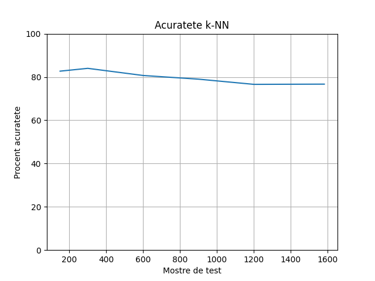

###Invatare automata - laborator 2 - filtrarea mesajelor spam - email

####Problema propusa
    Efectuați o analiză a mesajelor de email din propria căsuță poștală în vederea identificării mesajelor de tip spam pe baza instrumentelor puse la dispoziție de Python, R sau Java (Weka). Răspunsul va trebui să conțină:
    * o mică prezentare a soluției propuse, pas cu pas, de la preluarea și preprocesarea datelor până la evaluarea și îmbunătățirea performanțelor modelului/modelelor de învățare automată
    * scripturile/programele dezvoltate, cu menționarea bibliotecilor utilizate
    * bibliografia consultată

Pentru filtrarea mesajelor de tip spam, am ales sa folosesc algoritmul k-NN (k-nearest neighbors). 
Data set-ul folosit este Enron2 si poate fi descarcat de la adresa http://nlp.cs.aueb.gr/software_and_datasets/Enron-Spam/index.html. Acesta este inclus in proiectul curent, 
dar orice alt set de date poate fi utilizat.

###Rularea script-ului
Inainte de rulare, instalati dependentele folosind `pip install requirements.txt` din terminal. 
Script-ul poate fi rulat folosind comanda `python spam.py`. Data set-ul este arhivat in directorul dataset. Inainte de rulare, dezarhivati fiserul `enron2.tar.gz`.
La finalul rularii, acesta creeaza un grafic de acuratete in directorul curent.

###Pasi de implementare:

1. Incarcarea mail-urilor din directorul `dataset`. Acesta este compus din alte 2 subdirectoare. Directorul `ham` contine emailuri veridice, in timp ce directorul `spam` contine mesaje de tip neveridic.
2. Eliminarea semnelor de punctuatie si a simbolurilor
3. Eliminarea cuvintelor comune (pronume, articole, cuvinte de legatura)
4. Impartirea mail-urilor in 2 categorii: training si test (27% -> poate fi schimbat)
5. Pentru fiecare mail se calculeaza similaritatea intre acesta si mail-urile de training
6. Sortarea mail-urilor in functie de distanta euclidiana
7. Selectarea distantei cea mai scurta (aplicarea k-NN)
8. Interpreatarea tipului de mail

Grafic de acuratete

### Librarii folosite:
    - nltk
    - sklearn
    - numpy
    - pyplot

### Bibliografie

1. https://en.wikipedia.org/wiki/K-nearest_neighbors_algorithm
2. https://towardsdatascience.com/machine-learning-basics-with-the-k-nearest-neighbors-algorithm-6a6e71d01761
3. https://scikit-learn.org/stable/modules/model_evaluation.html

